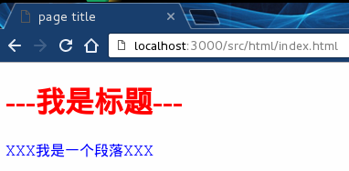
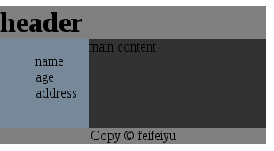
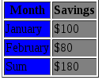
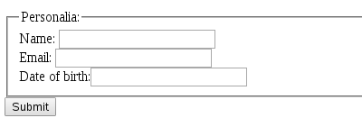
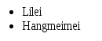

# 前端入门 #
## 基础
### 1、HTML / HTML5
### 2、CSS / CSS3
### 3、Javascript / JQuery 
<br>

## 推荐学习资料
### 学习站点： 
> W3C:  http://w3school.com.cn/,   
> W3C 2: http://www.runoob.com/
### 样式：
> http://codepen.io/
### 组件查找，代码抄袭：  
> https://github.com/，  
> https://www.npmjs.com/
### 书籍
> js: 《JavaScript高级程序设计》
> E6： [ECMAScript 6 入门](http://es6.ruanyifeng.com/#docs/intro) 阮一峰  
> CSS: <<CSS权威指南>>
### 推荐博客
> 阮一峰的网络日志： http://www.ruanyifeng.com/blog/  
> AlloyTeamm: http://www.alloyteam.com/

<br>

## 我们公司前端技术栈
> 设计稿尺寸测量，颜色提取   
> 理解使用 REST 风格 API  
> Django 模板语言  
> 原生 javascript 组件编写及使用   
> ES6  
> JQuery -> PC-Web  
> vue + vue-router + vuex -> h5 Web App  
> 微信 SDK  
> node & npm(依赖管理)   
> 工具打包 (webpack)  
> Chrome 调试  

<br><br><br>

# HTML 介绍 #

## 名词解释 ##
> **HTML 是一门用于描述网页的语言** 
> - HTML(Hyper Text Markup Language): 超文本标记语言
> - HTML 不是编程语言， 是一种标记语言
> - 标记语言是一套标记标签( Markup tag), 用于描述网页内容   

> **HTML 标签 / HTML 元素**
> - HTML 标签是由接括号(<>)包围的关键字, 且通常成对出现 
> - 例如： \<p>HTML\</p>, \<div>\\</div>， 
> - 标签中的第一个标签是开始标签(开放标签)， 第二个标签是结束标签(闭合标签),在开始结束标签之间插入内容 
> - 例外： \, \<input type="text" value="feifeiyu">, \<br/>

> **HTML 标签属性**
> - HTML 属性是附加于 HTML 标签中的信息   
> - 属性是以 key-value 形式出现的， 例如：\<input type="text">,  
> - value 值是字符串，必须包括在”“， ’‘中， 推荐使用 ”“  
> - HTML 文档大小写不敏感，规定 key和value 都使用小写，  
> - 如果key 或 value 有多个单词构成，推荐使用 - 进行分割， 例如： \<input id="input-name" type="text" data-id="123">
> - 属性可以根据需要定义，元素名不要与默认属性名冲突
> - 默认属性：   
>>| 属性    |  作用  |  
>>| ------ | ----- |  
>>| class | 为html元素定义一个或多个类名， 主要用于样式附着， 不同元素可以有相同的类名 |
>>| id | 为thml元素定义唯一的id， 同一页面中唯一|
>>| style | 规定元素的内联样式 |
>>| title | 描述了元素的额外信息 (鼠标悬浮与元素会显示出来) |

> **HTML 文档 / Web 页面**
> - HTML 文档 是一个由 HTML 标签及文本内容组成的文本文件（.html 文件)， 可以在浏览器中按一定形式展现

## HTML 文档组成 ##

```html
<!DOCTYPE html>  // 文档声明, 位于HTML文档第一行， 有助与浏览器中正确显示网页
<html> //告诉浏览器这是 html 文档， 限定html文档的开始和结束点
<head> //定义文档头部， 是所有头部元素的容器
    <meta charset="UTF-8"> //页面元信息
    <title>page title</title>  //页面标题color: #000;
    <link rel="stylesheet" href="./index.css">  //引入外部样式文件
</head>
<body>  //文档主题部分，可视区域
    <h1>---我是标题---</h1> //文档内容
    <p>XXX我是一个段落XXX</p>
</body>
<script>  //脚本， 必须在 <script> 标签内
    (function() {
        console.log('hello world')
    })()
</script>
</html>
```
> index.css 文件
```css
body {
    background: #fefefe;
}
h1 {
    color: red;
}
p {
    color: blue;
}
```

> 在浏览器中显示结果   
>    
> 整个文档中可见的区域为 \<body>\</body>标签中的内容 （&lt;script> 标签除外）  
> 页面标题则显示在浏览器的tab标签中

## HTML 文档渲染 ##
> 1、浏览器一边下载HTML文档， 一边开始解析文档，构建 HTML DOM树，渲染页面
>> (DOM: Document Object Model, 文档对象模型， 可以理解为网页各个元素的API, 他将网页的各个元素(节点)看作一个对象，利用浏览器脚本语言就可以操纵现在元素，改变其表现形式和属性)   

> 2、在解析过程中遇到外部样式引入标签\<link> 时， 浏览器渲染引擎会暂停解析， 等待样式文件加载完成， 解析样式文件，将样式规则和DOM树进行附着， 渲染输出  

> 3、如果遇到 \<script> 标签，渲染引擎停止渲染，将控制权交给脚本执行引擎。 
>> - 如果\<script>标签引用了外部脚本， 则下载该脚本，下载完成后执行脚本;  
>> - 直接在\<script>标签中书写的脚本则直接执行。  
>> - 执行完毕后，控制权交还给渲染引擎， 恢复往下解析HTML网页

> 4、不同浏览器的渲染引擎工作略有不同。资料 [Rendering Engine](http://ued.ctrip.com/blog/how-browsers-work-rendering-engine-html-parsing-series-ii.html)

## HTML 常用标签(元素) ##

### 一、头部和身体 ###
> **1、头部标签\<head>\</head>**
>> 头部标签，在浏览器窗口中不显示， 其可以包含的元素有 
>> - \<title>\</title>: 页面标题  
>> - \<meta>: 描述 HTML 文档的一些基本信息， 例如： 网页描述， 关键词设置， 页面配置等  
>> - \<style>\</stye>: 样式标签(其也可以放在\<body>中),  放置样式表  
>> - \<link>: 定义当前文档与外部文档之间的关系，主要用于下载外部样式文件
>> - \<script>: 用于编写内置脚本，或下载外部脚本
>> - \<base>: 描述了当前HTML文档中所有的链接标签的默认链接

> **2、文档主体\<body>\</body>**
>> 定义文档主体，包含文档中所有需要展示的内容， 例如： 文本， 图片， 列表， 表格，链接等。

### 二、按显示特征分 ###
> **1、块级元素**
> 在视觉上被格式化的块元素， 明显特征： 在浏览器显示时，会以新一行开始，且横向占满
> 块级元素可以设置 高度 & 宽度 & 内边距 & 外边距 样式
> 常见块级元素  

|元素|描述|
|---|---|
|div|HTML文档中最常用的标签, 现在网页一般都是基于 div+css 布局的， 无默认样式|
|h1,h2,..h6| 1～6级别标题标签，有默认样式|
|form| 表单， 定义一个包含表单元素的区域， 请求方法只支持： GET & POST|
| p | 段落， 填写文本内容 |
| ul/li | 无序列表组合， 项目默认用园点标记 |
| ol/li | 有序列表组合， 项目默认用数字来标记 |
| dl/dt/dd | 自定义列表组合， 适用于左右结构的布局 |
| iframe | 在同一个浏览器窗口中显示不止一个页面 |
| table/tr/ | 表格组合, 但默认宽度并非是父级元素的100% |
|
> **2、行内(内联)元素**  
> 行内元素不形成新内容块，即在其左右可以有其他元素, 明显特征： 在浏览器显示时不会以新行开始  
> 行内元素无法设置 高度 & 宽度 & 上下内边距 & 上下外边距 样式 (img, input, textarea, select, button 除外)
> 常见行内元素  

|元素|描述|
|---|---|
| a | 超链接标签 |
| i | 斜体文本 |
| em | 强调文本 |
| label | 主要为 input 元素定义标注， for 属性与相关元素 id 属性相同 |
| span | 常用内联文本容器， 无默认样式 |
| sub/sup | 下标/上标 |
| strong | 粗体强调 |
| textarea | 多行文本输入框 |
| input | 单行输入框，单选框，多选框，按钮 |
| button | 按钮, 可以插入文本或图片 |
| img | 图片元素 |
| select/option | 下拉列表组合 | 
|

### 二、按元素本身特点分 ###
> **1、替换元素**  
> 1、替换换素是浏览器根据其标签属性来判断显示其具体内容的，这些元素没有实际的内容
>> 例如：标签\, 在浏览器中显示的是其 src 属性的内容。
>> 常见替换元素， \, \<input>, \<textarea>, \<select>, \<object> (flash文件标签)   
> 2、替换元素在显示过程中生成了框（box)， 一般具有内在尺寸， 因此可以这些元素可以设置 高度 & 宽度 & 内边距 & 外边距  
> 3、不严谨地说，几乎所有替换元素都是**行内(内联)元素**, 由于他们可以设置宽高，这些元素又可以看成是 **行内(内联)块状元素**

> **2、非替换元素**
>> HTML 的大多数元素是不可替换元素，即其内容直接表现给用户端（例如浏览器）
>> 例如： 段落 \<p>feifeiyu\</p> 元素内容全在浏览器中显示出来
>> 不严谨地说 除了上面介绍的替换元素，剩下的基本就是非替换元素

### 三、按功能特点分 ###
> **1、文本展示**   
> | 元素名 | 描述 | 例 |  
> | ---- | --- | --- | 
> | \<span>feifeiyu\</span> |基本文本容器，无默认样式|
> | \<p>feifeiyu\</p> | 显示段落文本  |
> | \<a>feifeiyu\</a> | 超链接 |  <a href="#">feifeiyu</a>|
> | \<h1>Title\</h2>～\<h6></h6> | 显示标题文本  | 
> | \<sub>2\</sub>\<sup>4\</sup>  | 上标，下标  | <span>log<sub>2</sub><sup>4</sup> |
> | \<del>blue\</del> \<ins>red\</ins>| 删除, 添加 |  <span><del>blue</del> <ins>red</ins></span> |
> | \<bdo dir="rtl">\</bdo> | 定义文字显示方向 | \<span>\<bdo dir="rtl">feifeiyu\</bdo>\</span> <span><bdo dir="rtl">feifeiyu</bdo> |
> | \<pre>\</pre> | 预格式化文本，通常保留空格和换行符 |
>> 例： 
>>```html
>><pre>  
>> 此例演示如何使用 pre 标签  
>>
>> 对空行和 空格  
>> 进行控制  
>> </pre>  
>> ```
>> 

> - 其他： 不常用   
>> | 元素名 | 例 |  
>> | --- | --- |  
>> |\<mark>高亮文本\</mark> | <mark>高亮文本</mark> |
>> |\<q>定义短的引用语\</q> | <q>定义短的引用语</q> |
>> |\<cite> 定义引用、引证\</cite> | <cite> 定义引用、引证</cite> |
>> |\<b>这是一个加粗文本\</b>  | <b>这是一个加粗文本</b> |
>> |\<em>强调文本\</em> | <em>强调文本</em>|
>> |\<strong>加粗文本\</strong>  | <strong>加粗文本</strong>|
>> |\<dfn>定义项目\</dfn>  | <dfn>定义项目</dfn>|
>> |\<code>一段电脑代码\</code>  | <code>一段电脑代码</code>|
>> |\<samp>计算机样本\</samp>  | <samp>计算机样本</samp>|
>> |\<kbd>键盘输入\</kbd> | <kbd>键盘输入</kbd>|
>> |\<var>变量\</var> | <var>变量</var>|
>> |\<blockquote>定义长引用\</blockquote> |  <blockquote>定义长引用</blockquote> |
>> |\<address>显示地址\</address> | <address>显示地址</address> |
>> | ...... |

**2、表单&表单元素**
> 表单是一个包含表单元素的**区域**  
> ```html
> <form action="/user/info" method="POST">  
> ... input 元素  
> </form>  
> ```

> **表单元素包括：**  
>> | 元素名 | 描述 | 例 |  
>> | ---- | --- | --- |  
>> |\<textarea>\</textarea> | 多行文本输入 | <textarea >1235678</textarea>  |
>> |\<input type="text"> |单行文本输入 | <input type="text" placeholder ="单行文本输入">  |   
>> |\<input type="password"> |密码输入 | <input type="password" value="1235">  |
>> |\<input type="radio"> |单选框 | <input type="radio"> | 
>> |\<input type="checkbox">| 复选框 | <input type="checkbox"> | 
>> |\<input type="submit"> |提交按钮 | <input type="submit">  |
>> |\<input type="button">| 普通按钮 | <input type="button" value="button"> |
>> |\<input type="file"> 文件提交 | <input type="file">  
>> |\<select>\<option value=1>test\</option>\</select> | 下拉列表 |    <select><option value=1>test</option></select> |
>> |\<label for="">\</label> | 为表单元素定义标注 | <input type="radio"> <label for="test">YES</label>  |
>> |\<fieldset>\</fieldset> | 表单内相关元素分组，周围绘制边框 |  
>> |\<legend>\</legend> |  \<fieldset> 元素定义标题 |   例： | 
>>```html
>> <form>  
>>  <fieldset>  
>>    <legend>Personalia:</legend>  
>>    Name: <input type="text"><br>
>>    Email: <input type="text"><br>
>>    Date of birth:<input type="text">  
>>  </fieldset>  
>>  <input type="submit">
>></form>
>>```
>> 

**3、表格元素**
> | 元素名 | 描述 |
> | --- | --- |
> |\<table>\</table> | 定义表格 |
> |\<thead>\</thead> |表格页眉|  
> |\<tbody>\</tbody> |表格主体  |
> |\<tfoot>\</tfoot> |表格页脚  |
> |\<th>\</th> |表格的表头  |
> |\<tr>\</tr> |表格的行  |
> |\<tr>\</tr> |表格单元格  |
> |\<caption>\</caption>| 表格标题  |
> |\<colgroup>\</colgroup> |表格列的组  |
> |\<col>\</col> |用于表格列的属性  |
> 例：  
>> ```html
>> <table border="1">
>>  <colgroup>
>>    <col style="background-color:blue">
>>    <col style="background-color:gray">
>>  </colgroup>
>>  <thead>
>>    <tr>
>>      <th>Month</th>
>>      <th>Savings</th>
>>    </tr>
>>  </thead>
>>  <tfoot>
>>    <tr>
>>      <td>Sum</td>
>>      <td>$180</td>
>>    </tr>
>>  </tfoot>
>>  <tbody>
>>    <tr>
>>      <td>January</td>
>>      <td>$100</td>
>>    </tr>
>>    <tr>
>>      <td>February</td>
>>      <td>$80</td>
>>    </tr>
>>  </tbody>
>> ``` 
>></table>
>> <table border="1">
>>  <colgroup>
>>    <col style="background-color:blue">
>>    <col style="background-color:gray">
>>  </colgroup>
>>  <thead>
>>    <tr>
>>      <th>Month</th>
>>      <th>Savings</th>
>>    </tr>
>>  </thead>
>>  <tfoot>
>>    <tr>
>>      <td>Sum</td>
>>      <td>$180</td>
>>    </tr>
>>  </tfoot>
>>  <tbody>
>>    <tr>
>>      <td>January</td>
>>      <td>$100</td>
>>    </tr>
>>    <tr>
>>      <td>February</td>
>>      <td>$80</td>
>>    </tr>
>>  </tbody>
>></table>

**4、列表**
> - 无序列表, 最常见列表
>>```html
>> <ul>
>> <li>Lilei</li>
>> <li>Hangmeimei</li>
>> </ul>
>>```
>> 效果
>> <ul>
>> <li>Lilei</li>
>> <li>Hangmeimei</li>
>> </ul>

> - 有序列表
>> ```html
>> <ol>
>> <li>Lilei</li>
>> <li>Hangmeimei</li>
>> </ol>
>> ```
>> 效果
>> <ol>
>> <li>Lilei</li>
>> <li>Hangmeimei</li>
>> </ol>

> - 自定义列表, 左右结构布局时常用
>> ```html
>> <dl>
>>  <dt>Lilei</dt>
>>  <dd>- black hot drink</dd>
>>  <dt>Hangmeimei</dt>
>>  <dd>- white cold drink</dd>
>> </dl>
>> ```
>> 效果  
>> 

**4、框架**
> 通过使用框架，可以在同一个页面中嵌入另一个页面的内容  
> 使用：
>>```html
>><iframe src="//baidu.com" width="100" height="100"></iframe>
>> 或   
>> <iframe src="//baidu.com" name="iframe_a"></iframe>  
>> <p><a href="//google.com" target="iframe_a">google</a></p>
>>```

**5、图像**
> \ 是空标签，意思是说，它只包含属性，并且没有闭合标签。在浏览器上使用属性 src 来显示图片

**6、字符实体**    
> HTML 中使用字符为 HTML 的预留字符必须被替换为字符实体。
> 某些在键盘上找不到的字符也可以使用字符实体来替换

> 常用实体字符，
> | 实体名称 | 描述 |
> |------ | ------|
> | \&nbsp; | 空格, 在编写html文件是空格务必用 &nbsp; 代替 |
> | \&lt;, \&gt; | &lt; 小于号， &gt; 大于号 |
> | \&le;, \&ge; | &le; 小于等于， &ge; 大于等于 |
> | \&asymp; | &asymp; 约等于 |
> | \&plusmn; | &plusmn; 加减 |
> | \&yen; | &yen; 人民币，日圆符号 |
> | \&pound; | &pound; 英镑符号 |
> | \&sect; | &sect; 小节 |
> | \&copy; | &copy; 版权 |
> | \&reg; | &reg; 注册商标 |
> | \&times; | &times; 乘号 |
> | \&divide; | &divide; 除号 |
> | \&radic; | &radic; 勾 |
> |[更多实体字符](http://tool.xker.com/htmlchar.php) | 

## 页面样式 ##
> CSS (Cascading Style Sheets), 层叠样式表用于渲染HTML元素标签的样式
> CSS 引入 HTML 方式
> - 内联样式， 在HTML元素中使用 style 属性
> - 内部样式表， 在HTML文档中，用 \<sytle>\</sytle> 标签包裹CSS,
> - 外部样式表， 在HTML文档中，使用 \<link rel="stylesheet" href="/static/test.css"> 标签引入下载的CSS文件  

> CSS 可以干什么？
>> - 修改元素的尺寸， 边框， 背景， 显示方式， 内外边距 ...
>> - 修改文本颜色， 尺寸， 字体， 对齐方式 ...
>> - 一句话 CSS 是用来美化页面的

## 页面脚本 ##
> HTML 脚本用于增强页面的动态性和交互性
> HTML 文档通过 \<script>\</script> 标签容纳内部脚本
>```html
> <script>
>document.write("Hello World!");
></script>
>```
> 或者通过 \<script src="/static/test.js">\</script> src 属性来下载外部脚本文件。  

> \<noscript></noscript> 标签提供无法使用脚本时的替代内容，比方在浏览器禁用脚本时，或浏览器不支持客户端脚本时。只有在浏览器不支持脚本或者禁用脚本时，才会显示 \<noscript> 元素中的内容
>```html
> <script>
> document.write("Hello World!");
> </script>
> <noscript>
> 抱歉，您浏览器不支持脚本
> </noscript>
>```

## 页面布局 ##
> 1、基于 \<div> 的布局 (常用)
> ```html
> <body>
>    <div id="container" style="width:300px">
>        <div id="header" style="background-color:gray;">
>            <h1 style="margin-bottom:0;">header</h1>
>        </div>
>        <div id="menu" style="background-color:#778899;height:100px;width:100px;float:left;">
>            <ul style="list-style: none;">
>            <li>name</li>
>            <li>age</li>
>            <li>address</li>
>            </ul>
>        </div>
>        <div id="content" style="background-color:#323232;height:100px;width:200px;float:left;">
>        main content</div>
>        <div id="footer" style="background-color:gray;text-align:center;">
>        Copy © feifeiyu</div>
>    </div>
></body>
>```

> 2、基于 \<table> 的布局
> ```html 
> <body>
>     <table width="300" border="0">
>     <tr>
>         <td colspan="2" style="background-color:gray;">
>             <h1 style="margin: 0">header</h1>
>         </td>
>     </tr>
>     <tr>
>         <td style="background-color:#778899; width:100px;">
>             <ul style="list-style: none; padding: 0">
>                 <li>name</li>
>                 <li>age</li>
>                 <li>address</li>
>             </ul>
>         </td>
>         <td style="background-color:#323232;height:100px;width:200px;">
>         内容在这里</td>
>     </tr>
>     <tr>
>         <td colspan="2" style="background-color:gray;text-align:center;">
>     版权 © feifieyu </td>
>     </tr>
>     </table>
> </body>
> ```

> 布局效果图  
> 

# end #


